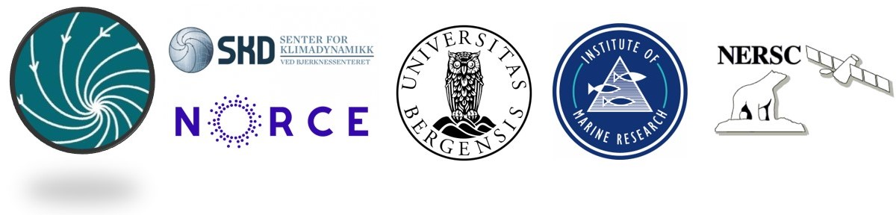

{width=60%}

# Key Topics

## Specify your **research activity and goals** that are relevant for sea level studies

## Is your research **observation based and/or model based?**

## What are your main **interests** related to the research activity?

## How can the sea level research group be of **value** to you ?

# {.tabset .tabset-fade .tabset-pills}
***

## Research activity

* **Ocean temperature and isotopic composition reconstruction** on million-year timescales; the latter is related to ice volume/sea level.  I am joining because I am leading the hazards theme and am excited about **strengthening activities on sea level**

* **Ice sheet** modelling (Greenland and Antarctica), ice sheet-climate interactions and couplind, contribution of ice sheets to sea-level

* Pacific **regional sea levels, CMIP6 sea levels - historical and projections**, CMIP6 sea level biases - Pacific regions, causes

* Understanding how **sea level** variability signals **from the open ocean are transmitted to the coastal ocean** across continental shelf edge using numerical modelling and downscaling approaches

* **Paleoclimate reconstructions**

* **Ocean Modelling**

* **Data Assimilation**. Goal: produce a 30-years **Arctic reanalysis** with 3D variables consistent with observed sea level from satellites.

* **Steric** sea level and **sea level budget** closure

* **Sedimentologist**, interested in **coastal changes in 21 Century** as a function og global sea-level changes, **extreme sea-level events, vertical land-movements, sediment supply and sediment distribution**

* Concurrency of **sea level and wave height extremes** in norwegian waters

* Short and long-term **prediction of sea level change** in the tropics


## Observation/Model based

```{r, echo=FALSE, message=FALSE, warning= FALSE}
DATA <- read.csv("OUT_OBS_MODEL.csv")
q <- DATA$q
perc <- DATA$f
df <- data.frame(q=q,perc=perc)
p <- plot_ly(df,x = ~perc, y = ~q, type = 'bar',
       name = ~q, color = ~q) %>%
       layout(yaxis = list(title = ''), xaxis = list(title = '(%)'), barmode = 'stack', margin = list(l = 300, r = 10, b = 50, t = 50, pad = 4))
p <- hide_legend(p)

p
```


## Interests

```{r, echo=FALSE, message=FALSE, warning= FALSE}

DATA <- read.csv("OUT_INTERESTS.csv")
q <- DATA$q
perc <- DATA$f
df <- data.frame(q=q,perc=perc)
p <- plot_ly(df,x = ~perc, y = ~q, type = 'bar',
       name = ~q, color = ~q) %>%
       layout(yaxis = list(title = ''), xaxis = list(title = '(%)'), barmode = 'stack', margin = list(l = 300, r = 10, b = 50, t = 50, pad = 4))
p <- hide_legend(p)

p

```

## Value

* Important aspect of **climate hazards**

* Exchange of **Information** and **Knowledge**;  **Collaborations**

* Introduction to people working on **similar research topics**, platform to **collaborate**, share **ideas**, identifying shared **research interests and methodologies**

* **Joint proposals**

* **I dont know...**

* **Sea level** is the very first data than **ocean model** need to be able to represent

* Would be good to work towards a **holistic sea level approach** within the BCCR, integrating all sea level components. Learning from each other, and possibly collaborating in future proposals/science

* **Expertise** is always valuable.

* **Cross-disciplinary skill** will advance the study of sea level budget closure

* To interact and **get knowledge of sea-level research** in Bergen

* **As I'm new to the topic - provide an overview of relevant research within the field**

